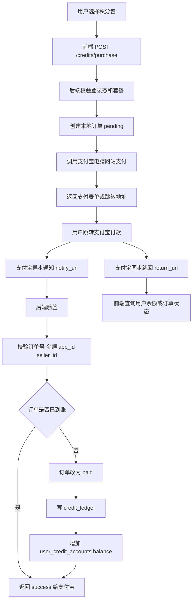
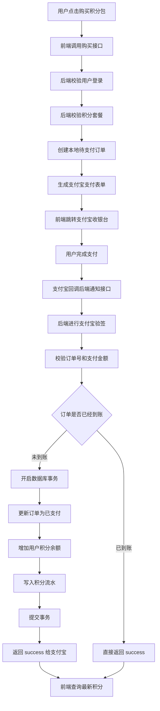
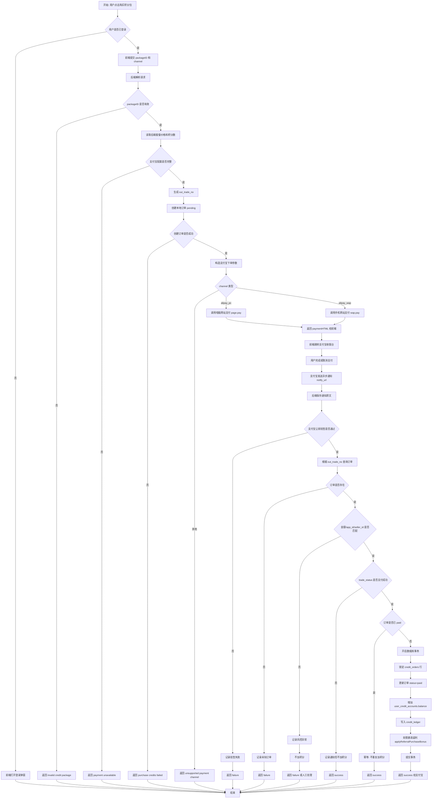
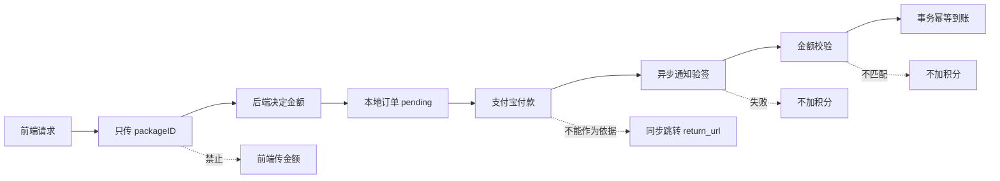
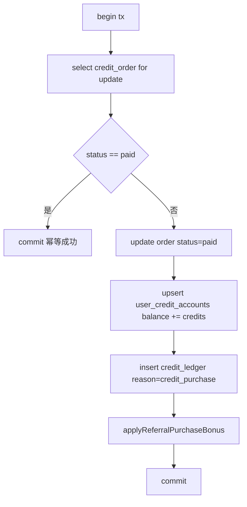
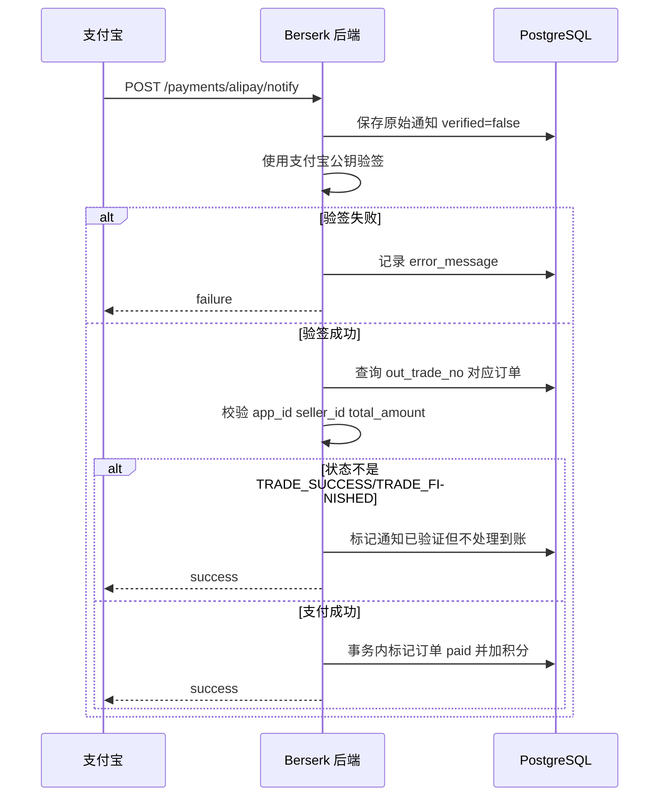
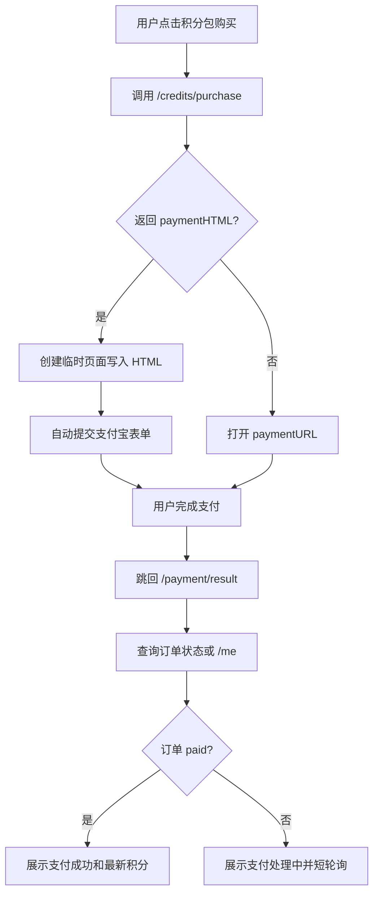

# 支付宝支付接入设计文档

## 目标

当前项目的积分购买接口已经具备套餐、订单、积分账户和积分流水基础，但购买流程仍偏 mock/内部到账。本文档设计将积分购买改造为真实支付宝支付：

- 用户选择积分包后创建待支付订单。
- 后端调用支付宝电脑网站支付，后续兼容手机网站支付。
- 支付宝异步通知后端。
- 后端验签、校验金额、幂等处理。
- 支付成功后写订单、积分账户和积分流水。

## 当前项目相关模块

- 前端：`studio`
- 后端：`backend`
- 积分套餐接口：`GET /berserk/api/v1/credits/packages`
- 当前购买接口：`POST /berserk/api/v1/credits/purchase`
- 现有表：
  - `credit_package_configs`
  - `credit_orders`
  - `user_credit_accounts`
  - `credit_ledger`
  - `user_referrals`

## 支付总流程



## 支付代码逻辑总流程



## 核心逻辑流程图

这张图描述从“用户点击购买”到“最终积分到账”的完整业务判断逻辑，后续写代码时可以按这个图拆分后端分支。



## 关键业务规则图



## 后台配置

正式环境建议通过环境变量或服务器配置注入，不提交到 Git。

```text
ALIPAY_APP_ID=2021006154650777
ALIPAY_APP_PRIVATE_KEY=应用私钥
ALIPAY_PUBLIC_KEY=支付宝公钥
ALIPAY_GATEWAY=https://openapi.alipay.com/gateway.do
ALIPAY_NOTIFY_URL=https://你的域名/berserk/api/v1/payments/alipay/notify
ALIPAY_RETURN_URL=https://你的域名/payment/result
ALIPAY_SELLER_ID=你的支付宝商户PID
```

说明：

- `ALIPAY_APP_PRIVATE_KEY` 只放后端，不进入前端。
- `notify_url` 是真正到账依据。
- `return_url` 只负责用户浏览器跳回，不能作为到账依据。
- `ALIPAY_SELLER_ID` 建议配置，用于异步通知二次校验。

## 接口设计

### 创建支付订单

复用现有接口：

```http
POST /berserk/api/v1/credits/purchase
Authorization: Bearer <token>
Content-Type: application/json
```

请求：

```json
{
  "packageID": "credits_100",
  "channel": "alipay_pc"
}
```

响应：

```json
{
  "order": {
    "id": "本地订单UUID",
    "userID": "用户ID",
    "packageID": "credits_100",
    "credits": 110,
    "amountCents": 1000,
    "currency": "CNY",
    "status": "pending",
    "provider": "alipay"
  },
  "paymentHTML": "<form ...>...</form>",
  "paymentURL": ""
}
```

处理规则：

- 后端必须根据 `packageID` 查询套餐价格和积分数量。
- 前端不能传金额，传了也不可信。
- 本地订单先落库为 `pending`。
- PC 端电脑网站支付建议返回支付宝自动提交表单。
- 手机网站支付后续可以使用同一接口，通过 `channel=alipay_wap` 切换。

### 支付宝异步通知

新增接口：

```http
POST /berserk/api/v1/payments/alipay/notify
Content-Type: application/x-www-form-urlencoded
```

响应：

```text
success
```

或：

```text
failure
```

处理规则：

- 必须使用支付宝公钥验签。
- 验签失败返回 `failure`。
- 验签成功后校验订单号、金额、`app_id`、`seller_id`。
- `TRADE_SUCCESS` 和 `TRADE_FINISHED` 才触发到账。
- 重复通知必须幂等。

### 查询订单状态

建议新增：

```http
GET /berserk/api/v1/credits/orders/:id
Authorization: Bearer <token>
```

响应：

```json
{
  "order": {
    "id": "本地订单UUID",
    "packageID": "credits_100",
    "credits": 110,
    "amountCents": 1000,
    "status": "paid",
    "provider": "alipay",
    "paidAt": "2026-06-17T00:00:00Z"
  },
  "user": {
    "id": "用户ID",
    "credits": 110
  }
}
```

用途：

- 支付完成跳回后刷新状态。
- 前端在支付结果页轮询订单状态。

## 订单状态

```text
pending   待支付
paid      已支付并已到账
closed    已关闭或超时
failed    支付失败或通知异常
refunded  已退款
```

## 数据库设计

### 扩展 credit_orders

现有 `credit_orders` 需要补充支付宝订单字段：

```sql
alter table credit_orders add column if not exists out_trade_no text not null default '';
alter table credit_orders add column if not exists provider_trade_no text not null default '';
alter table credit_orders add column if not exists paid_amount_cents integer not null default 0;
alter table credit_orders add column if not exists failed_reason text not null default '';
alter table credit_orders add column if not exists expired_at timestamptz;
alter table credit_orders add column if not exists updated_at timestamptz not null default now();

create unique index if not exists credit_orders_out_trade_no_idx
on credit_orders(out_trade_no)
where out_trade_no <> '';
```

字段说明：

- `out_trade_no`：本地商户订单号，传给支付宝，必须唯一。
- `provider_trade_no`：支付宝交易号，即 `trade_no`。
- `paid_amount_cents`：支付宝实际支付金额，单位分。
- `expired_at`：订单超时时间，可用于后续关闭订单。

### 新增支付宝通知表

建议新增通知日志表，方便排查验签、金额不一致、重复通知等问题：

```sql
create table if not exists alipay_notifications (
  id uuid primary key default gen_random_uuid(),
  out_trade_no text not null,
  trade_no text not null default '',
  trade_status text not null default '',
  total_amount text not null default '',
  raw_body text not null,
  verified boolean not null default false,
  processed boolean not null default false,
  error_message text not null default '',
  created_at timestamptz not null default now()
);

create index if not exists alipay_notifications_out_trade_no_idx
on alipay_notifications(out_trade_no, created_at desc);
```

## 后端代码结构建议

建议新增：

```text
backend/internal/payment/alipay/client.go
backend/internal/payment/alipay/sign.go
backend/internal/httpapi/alipay_payment.go
```

建议改造：

```text
backend/internal/config/config.go
backend/internal/httpapi/web_credits.go
backend/internal/httpapi/server.go
backend/internal/store/postgres.go
backend/internal/database/schema.go
backend/internal/models/models.go
```

### Store 层方法建议

当前 `CreateCreditOrder` 会创建订单并立即加积分。支付宝接入后需要拆分：

```text
CreatePendingCreditOrder(ctx, userID, pkg, provider, outTradeNo, expiredAt)
MarkCreditOrderPaid(ctx, outTradeNo, providerTradeNo, paidAmountCents)
GetCreditOrder(ctx, orderID, userID)
GetCreditOrderByOutTradeNo(ctx, outTradeNo)
RecordAlipayNotification(ctx, notification)
```

`MarkCreditOrderPaid` 必须在事务内完成：



## 异步通知详细流程



校验清单：

- `sign` 验签通过。
- `app_id == ALIPAY_APP_ID`。
- `seller_id == ALIPAY_SELLER_ID`，如配置。
- `out_trade_no` 能找到本地订单。
- 本地订单 `provider == alipay`。
- `total_amount` 转换为分后等于 `credit_orders.amount_cents`。
- `trade_status` 是 `TRADE_SUCCESS` 或 `TRADE_FINISHED`。

## 前端流程



前端改造点：

- 购买成功不再立即展示到账。
- 后端返回 `paymentHTML` 时提交支付宝表单。
- 新增支付结果页 `/payment/result`。
- 支付结果页以订单查询或 `/me` 为准刷新积分。

## 手机网站支付兼容

电脑网站支付和手机网站支付可共用本地订单与通知处理：

```text
channel=alipay_pc  -> alipay.trade.page.pay
channel=alipay_wap -> alipay.trade.wap.pay
```

差异：

- PC 端主要用于桌面浏览器。
- WAP 端用于手机浏览器。
- 两者都通过 `notify_url` 完成最终到账。

## 安全要求

- 私钥只放后端环境变量。
- 不信任前端金额。
- 不信任同步跳转。
- 异步通知必须验签。
- 到账逻辑必须幂等。
- 订单到账必须加数据库行锁。
- 支付宝通知原文建议落库。
- 正式环境必须使用 HTTPS。

## 测试用例

### 正常支付

```text
用户购买 credits_trial
创建 pending 订单
支付宝支付成功
异步通知验签通过
订单 paid
用户积分 +10
credit_ledger 写入 credit_purchase
```

### 重复通知

```text
同一 out_trade_no 重复收到 2 次 TRADE_SUCCESS
第一次到账
第二次直接返回 success
积分只增加一次
credit_ledger 只写一次
```

### 金额篡改

```text
本地订单金额 1000 分
通知 total_amount 不等于 10.00
记录异常
不加积分
返回 failure 或 success 并人工处理，按实现策略决定
```

### 验签失败

```text
通知签名不合法
记录 verified=false
不加积分
返回 failure
```

### 同步跳转先到

```text
用户先跳回 /payment/result
异步通知还未到
页面显示支付处理中
轮询订单
异步通知到账后页面刷新为成功
```

## 上线步骤

1. 支付宝后台确认电脑网站支付检测通过。
2. 开通手机网站支付。
3. 在沙箱环境实现并验证完整支付链路。
4. 验证重复通知幂等。
5. 验证金额不一致不会到账。
6. 验证正式环境 HTTPS notify_url 可访问。
7. 配置正式 `APP_ID`、应用私钥、支付宝公钥。
8. 正式环境使用 `credits_trial` 小额支付测试。
9. 确认订单、积分账户、积分流水全部正确。
10. 开放正式积分包购买入口。

## 关键结论

当前支付宝后台已经显示电脑网站支付 API 具备调用权限，因此可以进入代码接入阶段。代码实现时，最重要的是：

- 购买接口只创建待支付订单，不直接加积分。
- 支付宝异步通知验签成功后才加积分。
- 加积分必须事务化和幂等。
- 前端支付完成页只做展示和查询，不负责确认到账。
